# DER - el modelo de datos completo

**Generado el 29/09/2026 por `scripts/generate-der.mjs`, leyendo el catalogo de la base que corre.**
No se edita a mano: se regenera.

| | |
|---|---|
| Tablas del producto | **62** |
| Tablas de historia (`<tabla>_history`) | **57** |
| Claves foraneas | **130** |
| Tablas con RLS | **34** |
| Tablas append-only (sin UPDATE ni DELETE) | **animal_location, calibration, diagnosis, irrigation_event, measurement, spatial_index** |

**Como leer las marcas de cada tabla:**

- **RLS** -- el aislamiento entre clientes lo hace cumplir el motor en esa tabla.
- **historia** -- todo UPDATE y DELETE deja la fila anterior en `<tabla>_history`.
- **append-only** -- no tiene historia **porque no se puede cambiar**: el permiso esta revocado,
  que es mas fuerte que auditar.
- **catalogo** -- solo lectura para el producto. Agregar una fila aca es lo que evita una migracion.

## Cliente, identidad y permisos

### `client` -- RLS, historia

| columna | tipo | | |
|---|---|---|---|
| `id` | uuid | NOT NULL | PK |
| `name` | text | NOT NULL |  |
| `created_at` | timestamp with time zone | NOT NULL |  |
| `deleted_at` | timestamp with time zone |  |  |

### `module` -- historia, catalogo

| columna | tipo | | |
|---|---|---|---|
| `code` | text | NOT NULL | PK |
| `name` | text | NOT NULL |  |
| `created_at` | timestamp with time zone | NOT NULL |  |

### `client_module` -- RLS, historia

| columna | tipo | | |
|---|---|---|---|
| `tenant_id` | uuid | NOT NULL | PK, FK -> `client` |
| `module_code` | text | NOT NULL | PK, FK -> `module` |
| `granted_at` | timestamp with time zone | NOT NULL |  |
| `revoked_at` | timestamp with time zone |  |  |

### `app_user` -- RLS, historia

| columna | tipo | | |
|---|---|---|---|
| `id` | uuid | NOT NULL | PK |
| `email` | text | NOT NULL |  |
| `name` | text | NOT NULL |  |
| `status` | text | NOT NULL |  |
| `created_at` | timestamp with time zone | NOT NULL |  |
| `deleted_at` | timestamp with time zone |  |  |

### `credential` -- RLS, historia, catalogo

| columna | tipo | | |
|---|---|---|---|
| `id` | bigint | NOT NULL | PK |
| `user_id` | uuid | NOT NULL | FK -> `app_user` |
| `password_hash` | text | NOT NULL |  |
| `created_at` | timestamp with time zone | NOT NULL |  |
| `retired_at` | timestamp with time zone |  |  |

### `membership` -- RLS, historia

| columna | tipo | | |
|---|---|---|---|
| `id` | bigint | NOT NULL | PK |
| `tenant_id` | uuid | NOT NULL | FK -> `client` |
| `user_id` | uuid | NOT NULL | FK -> `app_user` |
| `status` | text | NOT NULL |  |
| `expires_at` | timestamp with time zone |  |  |
| `created_at` | timestamp with time zone | NOT NULL |  |

### `role` -- RLS, historia

| columna | tipo | | |
|---|---|---|---|
| `id` | bigint | NOT NULL | PK |
| `tenant_id` | uuid |  | FK -> `client` |
| `code` | text | NOT NULL |  |
| `name` | text | NOT NULL |  |
| `created_at` | timestamp with time zone | NOT NULL |  |
| `deleted_at` | timestamp with time zone |  |  |

### `role_permission` -- RLS, historia

| columna | tipo | | |
|---|---|---|---|
| `role_id` | bigint | NOT NULL | PK, FK -> `role` |
| `permission_id` | bigint | NOT NULL | PK, FK -> `permission` |

### `membership_role` -- RLS, historia

| columna | tipo | | |
|---|---|---|---|
| `membership_id` | bigint | NOT NULL | PK, FK -> `membership` |
| `role_id` | bigint | NOT NULL | PK, FK -> `role` |

### `resource` -- historia, catalogo

| columna | tipo | | |
|---|---|---|---|
| `code` | text | NOT NULL | PK |
| `module_code` | text | NOT NULL | FK -> `module` |

### `action` -- historia, catalogo

| columna | tipo | | |
|---|---|---|---|
| `code` | text | NOT NULL | PK |

### `permission` -- historia, catalogo

| columna | tipo | | |
|---|---|---|---|
| `id` | bigint | NOT NULL | PK |
| `resource_code` | text | NOT NULL | FK -> `resource` |
| `action_code` | text | NOT NULL | FK -> `action` |
| `code` | text |  |  |

## El terreno y los aparatos

### `farm` -- RLS, historia

| columna | tipo | | |
|---|---|---|---|
| `id` | bigint | NOT NULL | PK |
| `tenant_id` | uuid | NOT NULL | FK -> `client` |
| `name` | text | NOT NULL |  |
| `geom` | geometry |  |  |
| `geom_is_draft` | boolean | NOT NULL |  |
| `geom_version` | integer | NOT NULL |  |
| `created_at` | timestamp with time zone | NOT NULL |  |
| `deleted_at` | timestamp with time zone |  |  |

### `plot` -- RLS, historia

| columna | tipo | | |
|---|---|---|---|
| `id` | bigint | NOT NULL | PK |
| `tenant_id` | uuid | NOT NULL | FK -> `client` |
| `farm_id` | bigint | NOT NULL | FK -> `farm` |
| `name` | text | NOT NULL |  |
| `geom` | geometry | NOT NULL |  |
| `geom_is_draft` | boolean | NOT NULL |  |
| `geom_version` | integer | NOT NULL |  |
| `created_at` | timestamp with time zone | NOT NULL |  |
| `deleted_at` | timestamp with time zone |  |  |

### `device` -- RLS, historia

| columna | tipo | | |
|---|---|---|---|
| `id` | bigint | NOT NULL | PK |
| `tenant_id` | uuid | NOT NULL | FK -> `client` |
| `name` | text | NOT NULL |  |
| `type_code` | text | NOT NULL | FK -> `device_type` |
| `location` | geometry |  |  |
| `installed_at` | timestamp with time zone | NOT NULL |  |
| `removed_at` | timestamp with time zone |  |  |

### `device_type` -- historia, catalogo

| columna | tipo | | |
|---|---|---|---|
| `code` | text | NOT NULL | PK |
| `name` | text | NOT NULL |  |

## La medicion

### `unit` -- historia, catalogo

| columna | tipo | | |
|---|---|---|---|
| `code` | text | NOT NULL | PK |
| `name` | text | NOT NULL |  |

### `quantity` -- historia, catalogo

| columna | tipo | | |
|---|---|---|---|
| `code` | text | NOT NULL | PK |
| `name` | text | NOT NULL |  |
| `unit_code` | text | NOT NULL | FK -> `unit` |
| `min_value` | double precision |  |  |
| `max_value` | double precision |  |  |

### `calibration` -- RLS, historia, **append-only**

| columna | tipo | | |
|---|---|---|---|
| `id` | bigint | NOT NULL | PK |
| `tenant_id` | uuid | NOT NULL | FK -> `client` |
| `device_id` | bigint | NOT NULL | FK -> `device` |
| `quantity_code` | text | NOT NULL | FK -> `quantity` |
| `formula` | text | NOT NULL |  |
| `provenance` | text | NOT NULL |  |
| `valid_from` | timestamp with time zone | NOT NULL |  |
| `valid_to` | timestamp with time zone |  |  |

### `measurement` -- RLS, **append-only**

| columna | tipo | | |
|---|---|---|---|
| `tenant_id` | uuid | NOT NULL | FK -> `client` |
| `device_id` | bigint | NOT NULL | PK, FK -> `device` |
| `quantity_code` | text | NOT NULL | PK, FK -> `quantity` |
| `measured_at` | timestamp with time zone | NOT NULL | PK |
| `received_at` | timestamp with time zone | NOT NULL |  |
| `raw_value` | double precision | NOT NULL |  |
| `calibrated_value` | double precision |  |  |
| `calibration_id` | bigint |  | FK -> `calibration` |
| `location` | geometry |  |  |
| `animal_id` | bigint |  | FK -> `animal` |

## Riego

### `irrigation_method` -- historia, catalogo

| columna | tipo | | |
|---|---|---|---|
| `code` | text | NOT NULL | PK |
| `name` | text | NOT NULL |  |

### `irrigation_policy` -- RLS, historia

| columna | tipo | | |
|---|---|---|---|
| `id` | bigint | NOT NULL | PK |
| `tenant_id` | uuid | NOT NULL | FK -> `client` |
| `plot_id` | bigint | NOT NULL | FK -> `plot` |
| `method_code` | text | NOT NULL | FK -> `irrigation_method` |
| `parameters` | jsonb | NOT NULL |  |
| `days_to_fallback` | integer | NOT NULL |  |
| `valid_from` | timestamp with time zone | NOT NULL |  |
| `valid_to` | timestamp with time zone |  |  |
| `created_by` | uuid |  | FK -> `app_user` |

### `pipe_type` -- historia, catalogo

| columna | tipo | | |
|---|---|---|---|
| `code` | text | NOT NULL | PK |
| `name` | text | NOT NULL |  |

### `pipe` -- RLS, historia

| columna | tipo | | |
|---|---|---|---|
| `id` | bigint | NOT NULL | PK |
| `tenant_id` | uuid | NOT NULL | FK -> `client` |
| `plot_id` | bigint |  | FK -> `plot` |
| `parent_id` | bigint |  | FK -> `pipe` |
| `type_code` | text | NOT NULL | FK -> `pipe_type` |
| `diameter_mm` | double precision |  |  |
| `length_m` | double precision |  |  |
| `geom` | geometry |  |  |
| `installed_at` | timestamp with time zone | NOT NULL |  |
| `removed_at` | timestamp with time zone |  |  |

### `irrigation_decision` -- historia, catalogo

| columna | tipo | | |
|---|---|---|---|
| `code` | text | NOT NULL | PK |
| `name` | text | NOT NULL |  |

### `irrigation_event` -- RLS, **append-only**

| columna | tipo | | |
|---|---|---|---|
| `tenant_id` | uuid | NOT NULL | FK -> `client` |
| `plot_id` | bigint | NOT NULL | PK, FK -> `plot` |
| `device_id` | bigint |  | FK -> `device` |
| `decided_at` | timestamp with time zone | NOT NULL | PK |
| `recorded_at` | timestamp with time zone | NOT NULL |  |
| `conditions` | jsonb | NOT NULL |  |
| `decision_code` | text | NOT NULL | FK -> `irrigation_decision` |
| `policy_id` | bigint |  | FK -> `irrigation_policy` |
| `reason` | text |  |  |
| `effective_minutes` | double precision |  |  |
| `measured_litres` | double precision |  |  |
| `estimated_litres` | double precision |  |  |

## La campania: lo que se sembro y cuanto rindio

### `crop` -- historia, catalogo

| columna | tipo | | |
|---|---|---|---|
| `code` | text | NOT NULL | PK |
| `name` | text | NOT NULL |  |
| `scientific_name` | text |  |  |

### `crop_variety` -- historia, catalogo

| columna | tipo | | |
|---|---|---|---|
| `id` | bigint | NOT NULL | PK |
| `crop_code` | text | NOT NULL | FK -> `crop` |
| `code` | text | NOT NULL |  |
| `name` | text | NOT NULL |  |
| `cycle_days` | integer |  |  |

### `phenology_stage` -- historia, catalogo

| columna | tipo | | |
|---|---|---|---|
| `code` | text | NOT NULL | PK |
| `crop_code` | text |  | FK -> `crop` |
| `name` | text | NOT NULL |  |
| `ordinal` | integer | NOT NULL |  |

### `campaign` -- RLS, historia

| columna | tipo | | |
|---|---|---|---|
| `id` | bigint | NOT NULL | PK |
| `tenant_id` | uuid | NOT NULL | FK -> `client` |
| `plot_id` | bigint | NOT NULL | FK -> `plot` |
| `crop_code` | text | NOT NULL | FK -> `crop` |
| `variety_id` | bigint |  | FK -> `crop_variety` |
| `name` | text | NOT NULL |  |
| `sown_on` | date |  |  |
| `plant_density` | double precision |  |  |
| `row_spacing_cm` | double precision |  |  |
| `irrigated` | boolean | NOT NULL |  |
| `objective` | text |  |  |
| `started_at` | timestamp with time zone | NOT NULL |  |
| `ended_at` | timestamp with time zone |  |  |
| `notes` | text |  |  |
| `created_at` | timestamp with time zone | NOT NULL |  |
| `deleted_at` | timestamp with time zone |  |  |

### `campaign_stage` -- RLS, historia

| columna | tipo | | |
|---|---|---|---|
| `id` | bigint | NOT NULL | PK |
| `tenant_id` | uuid | NOT NULL | FK -> `client` |
| `campaign_id` | bigint | NOT NULL | FK -> `campaign` |
| `stage_code` | text | NOT NULL | FK -> `phenology_stage` |
| `observed_on` | date | NOT NULL |  |
| `recorded_at` | timestamp with time zone | NOT NULL |  |
| `recorded_by` | uuid |  | FK -> `app_user` |

### `experiment_factor` -- historia, catalogo

| columna | tipo | | |
|---|---|---|---|
| `code` | text | NOT NULL | PK |
| `name` | text | NOT NULL |  |
| `unit_code` | text |  | FK -> `unit` |

### `experiment_block` -- RLS, historia

| columna | tipo | | |
|---|---|---|---|
| `id` | bigint | NOT NULL | PK |
| `tenant_id` | uuid | NOT NULL | FK -> `client` |
| `campaign_id` | bigint | NOT NULL | FK -> `campaign` |
| `code` | text | NOT NULL |  |
| `name` | text | NOT NULL |  |
| `factor_code` | text |  | FK -> `experiment_factor` |
| `level_value` | double precision |  |  |
| `level_text` | text |  |  |
| `is_control` | boolean | NOT NULL |  |
| `plant_count` | integer |  |  |
| `geom` | geometry |  |  |
| `created_at` | timestamp with time zone | NOT NULL |  |
| `deleted_at` | timestamp with time zone |  |  |

### `harvest` -- RLS, historia

| columna | tipo | | |
|---|---|---|---|
| `id` | bigint | NOT NULL | PK |
| `tenant_id` | uuid | NOT NULL | FK -> `client` |
| `campaign_id` | bigint | NOT NULL | FK -> `campaign` |
| `block_id` | bigint |  | FK -> `experiment_block` |
| `harvested_on` | date | NOT NULL |  |
| `quantity_kg` | double precision |  |  |
| `units_harvested` | integer |  |  |
| `units_discarded` | integer |  |  |
| `discard_reason` | text |  |  |
| `quality_note` | text |  |  |
| `recorded_at` | timestamp with time zone | NOT NULL |  |
| `recorded_by` | uuid |  | FK -> `app_user` |

## Suelo, satelite y plagas

### `soil_parameter` -- historia, catalogo

| columna | tipo | | |
|---|---|---|---|
| `code` | text | NOT NULL | PK |
| `name` | text | NOT NULL |  |
| `unit_code` | text | NOT NULL | FK -> `unit` |
| `min_value` | double precision |  |  |
| `max_value` | double precision |  |  |

### `soil_analysis` -- RLS, historia

| columna | tipo | | |
|---|---|---|---|
| `id` | bigint | NOT NULL | PK |
| `tenant_id` | uuid | NOT NULL | FK -> `client` |
| `plot_id` | bigint | NOT NULL | FK -> `plot` |
| `sampled_on` | date | NOT NULL |  |
| `received_at` | timestamp with time zone | NOT NULL |  |
| `depth_from_cm` | double precision | NOT NULL |  |
| `depth_to_cm` | double precision | NOT NULL |  |
| `location` | geometry |  |  |
| `laboratory` | text | NOT NULL |  |
| `report_ref` | text |  |  |

### `soil_analysis_result` -- RLS, historia

| columna | tipo | | |
|---|---|---|---|
| `id` | bigint | NOT NULL | PK |
| `tenant_id` | uuid | NOT NULL | FK -> `client` |
| `analysis_id` | bigint | NOT NULL | FK -> `soil_analysis` |
| `parameter_code` | text | NOT NULL | FK -> `soil_parameter` |
| `value` | double precision | NOT NULL |  |
| `method` | text |  |  |

### `index_type` -- historia, catalogo

| columna | tipo | | |
|---|---|---|---|
| `code` | text | NOT NULL | PK |
| `name` | text | NOT NULL |  |
| `min_value` | double precision |  |  |
| `max_value` | double precision |  |  |

### `index_source` -- historia, catalogo

| columna | tipo | | |
|---|---|---|---|
| `code` | text | NOT NULL | PK |
| `name` | text | NOT NULL |  |
| `resolution_m` | double precision |  |  |

### `evalscript` -- historia, catalogo

| columna | tipo | | |
|---|---|---|---|
| `id` | bigint | NOT NULL | PK |
| `index_code` | text | NOT NULL | FK -> `index_type` |
| `source_code` | text | NOT NULL | FK -> `index_source` |
| `version` | integer | NOT NULL |  |
| `body` | text | NOT NULL |  |
| `provenance` | text | NOT NULL |  |
| `valid_from` | timestamp with time zone | NOT NULL |  |
| `valid_to` | timestamp with time zone |  |  |

### `spatial_index` -- RLS, **append-only**

| columna | tipo | | |
|---|---|---|---|
| `tenant_id` | uuid | NOT NULL | FK -> `client` |
| `plot_id` | bigint | NOT NULL | PK, FK -> `plot` |
| `index_code` | text | NOT NULL | PK, FK -> `index_type` |
| `source_code` | text | NOT NULL | PK, FK -> `index_source` |
| `evalscript_id` | bigint | NOT NULL | PK, FK -> `evalscript` |
| `geom_version` | integer | NOT NULL |  |
| `interval_from` | timestamp with time zone | NOT NULL | PK |
| `interval_to` | timestamp with time zone | NOT NULL |  |
| `retrieved_at` | timestamp with time zone | NOT NULL |  |
| `mean_value` | double precision |  |  |
| `p10_value` | double precision |  |  |
| `p90_value` | double precision |  |  |
| `min_value` | double precision |  |  |
| `max_value` | double precision |  |  |
| `stddev_value` | double precision |  |  |
| `sample_count` | integer | NOT NULL |  |
| `no_data_count` | integer | NOT NULL |  |
| `raster_uri` | text |  |  |

### `pest` -- historia, catalogo

| columna | tipo | | |
|---|---|---|---|
| `code` | text | NOT NULL | PK |
| `name` | text | NOT NULL |  |
| `scientific_name` | text |  |  |

### `pest_trap_catch` -- RLS, historia

| columna | tipo | | |
|---|---|---|---|
| `id` | bigint | NOT NULL | PK |
| `tenant_id` | uuid | NOT NULL | FK -> `client` |
| `device_id` | bigint | NOT NULL | FK -> `device` |
| `pest_code` | text | NOT NULL | FK -> `pest` |
| `counted_on` | date | NOT NULL |  |
| `received_at` | timestamp with time zone | NOT NULL |  |
| `count_value` | integer | NOT NULL |  |
| `days_exposed` | integer |  |  |
| `recorded_by` | uuid |  | FK -> `app_user` |

## Lo que se vio, lo que se cree y lo que se aplico

### `observation_extent` -- historia, catalogo

| columna | tipo | | |
|---|---|---|---|
| `code` | text | NOT NULL | PK |
| `name` | text | NOT NULL |  |
| `ordinal` | integer | NOT NULL |  |

### `symptom` -- historia, catalogo

| columna | tipo | | |
|---|---|---|---|
| `code` | text | NOT NULL | PK |
| `name` | text | NOT NULL |  |
| `applies_to` | text | NOT NULL |  |

### `condition` -- historia, catalogo

| columna | tipo | | |
|---|---|---|---|
| `code` | text | NOT NULL | PK |
| `name` | text | NOT NULL |  |
| `kind` | text | NOT NULL |  |
| `applies_to` | text | NOT NULL |  |

### `diagnosis_source` -- historia, catalogo

| columna | tipo | | |
|---|---|---|---|
| `code` | text | NOT NULL | PK |
| `name` | text | NOT NULL |  |
| `trains_model` | boolean | NOT NULL |  |

### `input_product` -- historia, catalogo

| columna | tipo | | |
|---|---|---|---|
| `code` | text | NOT NULL | PK |
| `name` | text | NOT NULL |  |
| `kind` | text | NOT NULL |  |
| `active_ingredient` | text |  |  |
| `withdrawal_days` | integer |  |  |

### `observation` -- RLS, historia

| columna | tipo | | |
|---|---|---|---|
| `id` | bigint | NOT NULL | PK |
| `tenant_id` | uuid | NOT NULL | FK -> `client` |
| `observed_at` | timestamp with time zone | NOT NULL |  |
| `received_at` | timestamp with time zone | NOT NULL |  |
| `plot_id` | bigint |  | FK -> `plot` |
| `campaign_id` | bigint |  | FK -> `campaign` |
| `block_id` | bigint |  | FK -> `experiment_block` |
| `location` | geometry |  |  |
| `extent_code` | text | NOT NULL | FK -> `observation_extent` |
| `affected_count` | integer |  |  |
| `inspected_count` | integer |  |  |
| `stage_code` | text |  | FK -> `phenology_stage` |
| `notes` | text |  |  |
| `observed_by` | uuid |  | FK -> `app_user` |
| `created_at` | timestamp with time zone | NOT NULL |  |
| `animal_id` | bigint |  | FK -> `animal` |
| `animal_group_id` | bigint |  | FK -> `animal_group` |

### `observation_symptom` -- RLS, historia

| columna | tipo | | |
|---|---|---|---|
| `observation_id` | bigint | NOT NULL | PK, FK -> `observation` |
| `symptom_code` | text | NOT NULL | PK, FK -> `symptom` |

### `diagnosis` -- RLS, **append-only**

| columna | tipo | | |
|---|---|---|---|
| `id` | bigint | NOT NULL | PK |
| `tenant_id` | uuid | NOT NULL | FK -> `client` |
| `observation_id` | bigint | NOT NULL | FK -> `observation` |
| `condition_code` | text | NOT NULL | FK -> `condition` |
| `source_code` | text | NOT NULL | FK -> `diagnosis_source` |
| `confidence` | double precision |  |  |
| `model_version` | text |  |  |
| `stated_by` | uuid |  | FK -> `app_user` |
| `stated_at` | timestamp with time zone | NOT NULL |  |
| `rationale` | text |  |  |

### `treatment` -- RLS, historia

| columna | tipo | | |
|---|---|---|---|
| `id` | bigint | NOT NULL | PK |
| `tenant_id` | uuid | NOT NULL | FK -> `client` |
| `observation_id` | bigint |  | FK -> `observation` |
| `plot_id` | bigint |  | FK -> `plot` |
| `campaign_id` | bigint |  | FK -> `campaign` |
| `block_id` | bigint |  | FK -> `experiment_block` |
| `product_code` | text | NOT NULL | FK -> `input_product` |
| `dose` | double precision |  |  |
| `dose_unit_code` | text |  | FK -> `unit` |
| `applied_at` | timestamp with time zone | NOT NULL |  |
| `received_at` | timestamp with time zone | NOT NULL |  |
| `withdrawal_until` | date |  |  |
| `applied_by` | uuid |  | FK -> `app_user` |
| `notes` | text |  |  |
| `animal_id` | bigint |  | FK -> `animal` |
| `animal_group_id` | bigint |  | FK -> `animal_group` |

### `photo` -- RLS, historia

| columna | tipo | | |
|---|---|---|---|
| `id` | bigint | NOT NULL | PK |
| `tenant_id` | uuid | NOT NULL | FK -> `client` |
| `storage_uri` | text | NOT NULL |  |
| `content_hash` | text | NOT NULL |  |
| `content_type` | text | NOT NULL |  |
| `byte_size` | bigint |  |  |
| `taken_at` | timestamp with time zone |  |  |
| `received_at` | timestamp with time zone | NOT NULL |  |
| `location` | geometry |  |  |
| `location_source` | text |  |  |
| `plot_id` | bigint |  | FK -> `plot` |
| `campaign_id` | bigint |  | FK -> `campaign` |
| `block_id` | bigint |  | FK -> `experiment_block` |
| `observation_id` | bigint |  | FK -> `observation` |
| `stage_code` | text |  | FK -> `phenology_stage` |
| `taken_by` | uuid |  | FK -> `app_user` |
| `exif` | jsonb |  |  |
| `deleted_at` | timestamp with time zone |  |  |
| `animal_id` | bigint |  | FK -> `animal` |
| `animal_group_id` | bigint |  | FK -> `animal_group` |

## Ganaderia

### `animal_species` -- historia, catalogo

| columna | tipo | | |
|---|---|---|---|
| `code` | text | NOT NULL | PK |
| `name` | text | NOT NULL |  |

### `breed` -- historia, catalogo

| columna | tipo | | |
|---|---|---|---|
| `code` | text | NOT NULL | PK |
| `species_code` | text | NOT NULL | FK -> `animal_species` |
| `name` | text | NOT NULL |  |

### `animal_status` -- historia, catalogo

| columna | tipo | | |
|---|---|---|---|
| `code` | text | NOT NULL | PK |
| `name` | text | NOT NULL |  |
| `is_live` | boolean | NOT NULL |  |

### `location_source` -- historia, catalogo

| columna | tipo | | |
|---|---|---|---|
| `code` | text | NOT NULL | PK |
| `name` | text | NOT NULL |  |
| `is_exact` | boolean | NOT NULL |  |

### `animal` -- RLS, historia

| columna | tipo | | |
|---|---|---|---|
| `id` | bigint | NOT NULL | PK |
| `tenant_id` | uuid | NOT NULL | FK -> `client` |
| `tag` | text | NOT NULL |  |
| `rfid` | text |  |  |
| `species_code` | text | NOT NULL | FK -> `animal_species` |
| `breed_code` | text |  | FK -> `breed` |
| `sex` | text |  |  |
| `born_on` | date |  |  |
| `mother_id` | bigint |  | FK -> `animal` |
| `status_code` | text | NOT NULL | FK -> `animal_status` |
| `entered_at` | timestamp with time zone | NOT NULL |  |
| `left_at` | timestamp with time zone |  |  |
| `left_reason` | text |  |  |
| `created_at` | timestamp with time zone | NOT NULL |  |

### `animal_group` -- RLS, historia

| columna | tipo | | |
|---|---|---|---|
| `id` | bigint | NOT NULL | PK |
| `tenant_id` | uuid | NOT NULL | FK -> `client` |
| `name` | text | NOT NULL |  |
| `purpose` | text |  |  |
| `created_at` | timestamp with time zone | NOT NULL |  |
| `closed_at` | timestamp with time zone |  |  |
| `deleted_at` | timestamp with time zone |  |  |

### `animal_group_member` -- RLS, historia

| columna | tipo | | |
|---|---|---|---|
| `id` | bigint | NOT NULL | PK |
| `tenant_id` | uuid | NOT NULL | FK -> `client` |
| `animal_id` | bigint | NOT NULL | FK -> `animal` |
| `group_id` | bigint | NOT NULL | FK -> `animal_group` |
| `joined_at` | timestamp with time zone | NOT NULL |  |
| `left_at` | timestamp with time zone |  |  |

### `animal_location` -- RLS, **append-only**

| columna | tipo | | |
|---|---|---|---|
| `tenant_id` | uuid | NOT NULL | FK -> `client` |
| `animal_id` | bigint | NOT NULL | PK, FK -> `animal` |
| `observed_at` | timestamp with time zone | NOT NULL | PK |
| `received_at` | timestamp with time zone | NOT NULL |  |
| `source_code` | text | NOT NULL | FK -> `location_source` |
| `plot_id` | bigint |  | FK -> `plot` |
| `location` | geometry |  |  |
| `device_id` | bigint |  | FK -> `device` |
| `accuracy_m` | double precision |  |  |

### `ration` -- RLS, historia

| columna | tipo | | |
|---|---|---|---|
| `id` | bigint | NOT NULL | PK |
| `tenant_id` | uuid | NOT NULL | FK -> `client` |
| `animal_group_id` | bigint |  | FK -> `animal_group` |
| `animal_id` | bigint |  | FK -> `animal` |
| `product_code` | text | NOT NULL | FK -> `input_product` |
| `offered_at` | timestamp with time zone | NOT NULL |  |
| `received_at` | timestamp with time zone | NOT NULL |  |
| `quantity_kg` | double precision | NOT NULL |  |
| `refused_kg` | double precision |  |  |
| `recorded_by` | uuid |  | FK -> `app_user` |

## Las tablas de historia

Son **57** y todas tienen la misma forma, porque las genera un solo bucle y las llena un
solo trigger. Listarlas una por una seria repetir 57 veces lo mismo:

| columna | tipo | |
|---|---|---|
| `id` | bigint | PK |
| `operation` | text | `UPDATE` o `DELETE` |
| `changed_at` | timestamptz | |
| `changed_by` | uuid | FK -> `app_user` |
| `row_data` | jsonb | **la fila entera como estaba ANTES** |

**No se pueden editar ni borrar**: el permiso esta revocado para `agro_app` y para
`agro_control`. Una historia que se puede reescribir no es una historia.

## El grafo completo

Las 130 claves foraneas, incluidas las 28
que apuntan a `client` -- que son el multi-cliente y estan en casi todas las tablas.

```mermaid
erDiagram
  client {
    uuid id PK
  }
  module {
    text code PK
  }
  client_module {
    uuid tenant_id PK,FK
    text module_code PK,FK
  }
  app_user {
    uuid id PK
  }
  credential {
    bigint id PK
    uuid user_id FK
  }
  membership {
    bigint id PK
    uuid tenant_id FK
    uuid user_id FK
  }
  role {
    bigint id PK
    uuid tenant_id FK
  }
  role_permission {
    bigint role_id PK,FK
    bigint permission_id PK,FK
  }
  membership_role {
    bigint membership_id PK,FK
    bigint role_id PK,FK
  }
  resource {
    text code PK
    text module_code FK
  }
  action {
    text code PK
  }
  permission {
    bigint id PK
    text resource_code FK
    text action_code FK
  }
  farm {
    bigint id PK
    uuid tenant_id FK
  }
  plot {
    bigint id PK
    uuid tenant_id FK
    bigint farm_id FK
  }
  device {
    bigint id PK
    uuid tenant_id FK
    text type_code FK
  }
  device_type {
    text code PK
  }
  unit {
    text code PK
  }
  quantity {
    text code PK
    text unit_code FK
  }
  calibration {
    bigint id PK
    uuid tenant_id FK
    bigint device_id FK
    text quantity_code FK
  }
  measurement {
    uuid tenant_id FK
    bigint device_id PK,FK
    text quantity_code PK,FK
    timestamp_with_time_zone measured_at PK
    bigint calibration_id FK
    bigint animal_id FK
  }
  irrigation_method {
    text code PK
  }
  irrigation_policy {
    bigint id PK
    uuid tenant_id FK
    bigint plot_id FK
    text method_code FK
    uuid created_by FK
  }
  pipe_type {
    text code PK
  }
  pipe {
    bigint id PK
    uuid tenant_id FK
    bigint plot_id FK
    bigint parent_id FK
    text type_code FK
  }
  irrigation_decision {
    text code PK
  }
  irrigation_event {
    uuid tenant_id FK
    bigint plot_id PK,FK
    bigint device_id FK
    timestamp_with_time_zone decided_at PK
    text decision_code FK
    bigint policy_id FK
  }
  crop {
    text code PK
  }
  crop_variety {
    bigint id PK
    text crop_code FK
  }
  phenology_stage {
    text code PK
    text crop_code FK
  }
  campaign {
    bigint id PK
    uuid tenant_id FK
    bigint plot_id FK
    text crop_code FK
    bigint variety_id FK
  }
  campaign_stage {
    bigint id PK
    uuid tenant_id FK
    bigint campaign_id FK
    text stage_code FK
    uuid recorded_by FK
  }
  experiment_factor {
    text code PK
    text unit_code FK
  }
  experiment_block {
    bigint id PK
    uuid tenant_id FK
    bigint campaign_id FK
    text factor_code FK
  }
  harvest {
    bigint id PK
    uuid tenant_id FK
    bigint campaign_id FK
    bigint block_id FK
    uuid recorded_by FK
  }
  soil_parameter {
    text code PK
    text unit_code FK
  }
  soil_analysis {
    bigint id PK
    uuid tenant_id FK
    bigint plot_id FK
  }
  soil_analysis_result {
    bigint id PK
    uuid tenant_id FK
    bigint analysis_id FK
    text parameter_code FK
  }
  index_type {
    text code PK
  }
  index_source {
    text code PK
  }
  evalscript {
    bigint id PK
    text index_code FK
    text source_code FK
  }
  spatial_index {
    uuid tenant_id FK
    bigint plot_id PK,FK
    text index_code PK,FK
    text source_code PK,FK
    bigint evalscript_id PK,FK
    timestamp_with_time_zone interval_from PK
  }
  pest {
    text code PK
  }
  pest_trap_catch {
    bigint id PK
    uuid tenant_id FK
    bigint device_id FK
    text pest_code FK
    uuid recorded_by FK
  }
  observation_extent {
    text code PK
  }
  symptom {
    text code PK
  }
  condition {
    text code PK
  }
  diagnosis_source {
    text code PK
  }
  input_product {
    text code PK
  }
  observation {
    bigint id PK
    uuid tenant_id FK
    bigint plot_id FK
    bigint campaign_id FK
    bigint block_id FK
    text extent_code FK
    text stage_code FK
    uuid observed_by FK
    bigint animal_id FK
    bigint animal_group_id FK
  }
  observation_symptom {
    bigint observation_id PK,FK
    text symptom_code PK,FK
  }
  diagnosis {
    bigint id PK
    uuid tenant_id FK
    bigint observation_id FK
    text condition_code FK
    text source_code FK
    uuid stated_by FK
  }
  treatment {
    bigint id PK
    uuid tenant_id FK
    bigint observation_id FK
    bigint plot_id FK
    bigint campaign_id FK
    bigint block_id FK
    text product_code FK
    text dose_unit_code FK
    uuid applied_by FK
    bigint animal_id FK
    bigint animal_group_id FK
  }
  photo {
    bigint id PK
    uuid tenant_id FK
    bigint plot_id FK
    bigint campaign_id FK
    bigint block_id FK
    bigint observation_id FK
    text stage_code FK
    uuid taken_by FK
    bigint animal_id FK
    bigint animal_group_id FK
  }
  animal_species {
    text code PK
  }
  breed {
    text code PK
    text species_code FK
  }
  animal_status {
    text code PK
  }
  location_source {
    text code PK
  }
  animal {
    bigint id PK
    uuid tenant_id FK
    text species_code FK
    text breed_code FK
    bigint mother_id FK
    text status_code FK
  }
  animal_group {
    bigint id PK
    uuid tenant_id FK
  }
  animal_group_member {
    bigint id PK
    uuid tenant_id FK
    bigint animal_id FK
    bigint group_id FK
  }
  animal_location {
    uuid tenant_id FK
    bigint animal_id PK,FK
    timestamp_with_time_zone observed_at PK
    text source_code FK
    bigint plot_id FK
    bigint device_id FK
  }
  ration {
    bigint id PK
    uuid tenant_id FK
    bigint animal_group_id FK
    bigint animal_id FK
    text product_code FK
    uuid recorded_by FK
  }
  breed ||--o{ animal : "breed_code"
  animal ||--o{ animal : "mother_id"
  animal_species ||--o{ animal : "species_code"
  animal_status ||--o{ animal : "status_code"
  client ||--o{ animal : "tenant_id"
  client ||--o{ animal_group : "tenant_id"
  animal ||--o{ animal_group_member : "animal_id"
  animal_group ||--o{ animal_group_member : "group_id"
  client ||--o{ animal_group_member : "tenant_id"
  animal ||--o{ animal_location : "animal_id"
  device ||--o{ animal_location : "device_id"
  plot ||--o{ animal_location : "plot_id"
  location_source ||--o{ animal_location : "source_code"
  client ||--o{ animal_location : "tenant_id"
  animal_species ||--o{ breed : "species_code"
  device ||--o{ calibration : "device_id"
  quantity ||--o{ calibration : "quantity_code"
  client ||--o{ calibration : "tenant_id"
  crop ||--o{ campaign : "crop_code"
  plot ||--o{ campaign : "plot_id"
  client ||--o{ campaign : "tenant_id"
  crop_variety ||--o{ campaign : "variety_id"
  campaign ||--o{ campaign_stage : "campaign_id"
  app_user ||--o{ campaign_stage : "recorded_by"
  phenology_stage ||--o{ campaign_stage : "stage_code"
  client ||--o{ campaign_stage : "tenant_id"
  module ||--o{ client_module : "module_code"
  client ||--o{ client_module : "tenant_id"
  app_user ||--o{ credential : "user_id"
  crop ||--o{ crop_variety : "crop_code"
  client ||--o{ device : "tenant_id"
  device_type ||--o{ device : "type_code"
  condition ||--o{ diagnosis : "condition_code"
  observation ||--o{ diagnosis : "observation_id"
  diagnosis_source ||--o{ diagnosis : "source_code"
  app_user ||--o{ diagnosis : "stated_by"
  client ||--o{ diagnosis : "tenant_id"
  index_type ||--o{ evalscript : "index_code"
  index_source ||--o{ evalscript : "source_code"
  campaign ||--o{ experiment_block : "campaign_id"
  experiment_factor ||--o{ experiment_block : "factor_code"
  client ||--o{ experiment_block : "tenant_id"
  unit ||--o{ experiment_factor : "unit_code"
  client ||--o{ farm : "tenant_id"
  experiment_block ||--o{ harvest : "block_id"
  campaign ||--o{ harvest : "campaign_id"
  app_user ||--o{ harvest : "recorded_by"
  client ||--o{ harvest : "tenant_id"
  irrigation_decision ||--o{ irrigation_event : "decision_code"
  device ||--o{ irrigation_event : "device_id"
  plot ||--o{ irrigation_event : "plot_id"
  irrigation_policy ||--o{ irrigation_event : "policy_id"
  client ||--o{ irrigation_event : "tenant_id"
  app_user ||--o{ irrigation_policy : "created_by"
  irrigation_method ||--o{ irrigation_policy : "method_code"
  plot ||--o{ irrigation_policy : "plot_id"
  client ||--o{ irrigation_policy : "tenant_id"
  animal ||--o{ measurement : "animal_id"
  calibration ||--o{ measurement : "calibration_id"
  device ||--o{ measurement : "device_id"
  quantity ||--o{ measurement : "quantity_code"
  client ||--o{ measurement : "tenant_id"
  client ||--o{ membership : "tenant_id"
  app_user ||--o{ membership : "user_id"
  membership ||--o{ membership_role : "membership_id"
  role ||--o{ membership_role : "role_id"
  animal_group ||--o{ observation : "animal_group_id"
  animal ||--o{ observation : "animal_id"
  experiment_block ||--o{ observation : "block_id"
  campaign ||--o{ observation : "campaign_id"
  observation_extent ||--o{ observation : "extent_code"
  app_user ||--o{ observation : "observed_by"
  plot ||--o{ observation : "plot_id"
  phenology_stage ||--o{ observation : "stage_code"
  client ||--o{ observation : "tenant_id"
  observation ||--o{ observation_symptom : "observation_id"
  symptom ||--o{ observation_symptom : "symptom_code"
  action ||--o{ permission : "action_code"
  resource ||--o{ permission : "resource_code"
  device ||--o{ pest_trap_catch : "device_id"
  pest ||--o{ pest_trap_catch : "pest_code"
  app_user ||--o{ pest_trap_catch : "recorded_by"
  client ||--o{ pest_trap_catch : "tenant_id"
  crop ||--o{ phenology_stage : "crop_code"
  animal_group ||--o{ photo : "animal_group_id"
  animal ||--o{ photo : "animal_id"
  experiment_block ||--o{ photo : "block_id"
  campaign ||--o{ photo : "campaign_id"
  observation ||--o{ photo : "observation_id"
  plot ||--o{ photo : "plot_id"
  phenology_stage ||--o{ photo : "stage_code"
  app_user ||--o{ photo : "taken_by"
  client ||--o{ photo : "tenant_id"
  pipe ||--o{ pipe : "parent_id"
  plot ||--o{ pipe : "plot_id"
  client ||--o{ pipe : "tenant_id"
  pipe_type ||--o{ pipe : "type_code"
  farm ||--o{ plot : "farm_id"
  client ||--o{ plot : "tenant_id"
  unit ||--o{ quantity : "unit_code"
  animal_group ||--o{ ration : "animal_group_id"
  animal ||--o{ ration : "animal_id"
  input_product ||--o{ ration : "product_code"
  app_user ||--o{ ration : "recorded_by"
  client ||--o{ ration : "tenant_id"
  module ||--o{ resource : "module_code"
  client ||--o{ role : "tenant_id"
  permission ||--o{ role_permission : "permission_id"
  role ||--o{ role_permission : "role_id"
  plot ||--o{ soil_analysis : "plot_id"
  client ||--o{ soil_analysis : "tenant_id"
  soil_analysis ||--o{ soil_analysis_result : "analysis_id"
  soil_parameter ||--o{ soil_analysis_result : "parameter_code"
  client ||--o{ soil_analysis_result : "tenant_id"
  unit ||--o{ soil_parameter : "unit_code"
  evalscript ||--o{ spatial_index : "evalscript_id"
  index_type ||--o{ spatial_index : "index_code"
  plot ||--o{ spatial_index : "plot_id"
  index_source ||--o{ spatial_index : "source_code"
  client ||--o{ spatial_index : "tenant_id"
  animal_group ||--o{ treatment : "animal_group_id"
  animal ||--o{ treatment : "animal_id"
  app_user ||--o{ treatment : "applied_by"
  experiment_block ||--o{ treatment : "block_id"
  campaign ||--o{ treatment : "campaign_id"
  unit ||--o{ treatment : "dose_unit_code"
  observation ||--o{ treatment : "observation_id"
  plot ||--o{ treatment : "plot_id"
  input_product ||--o{ treatment : "product_code"
  client ||--o{ treatment : "tenant_id"
```

